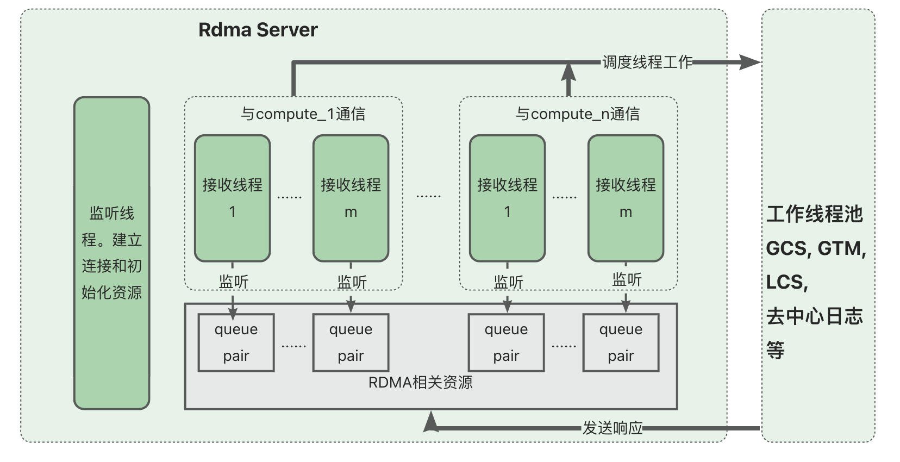
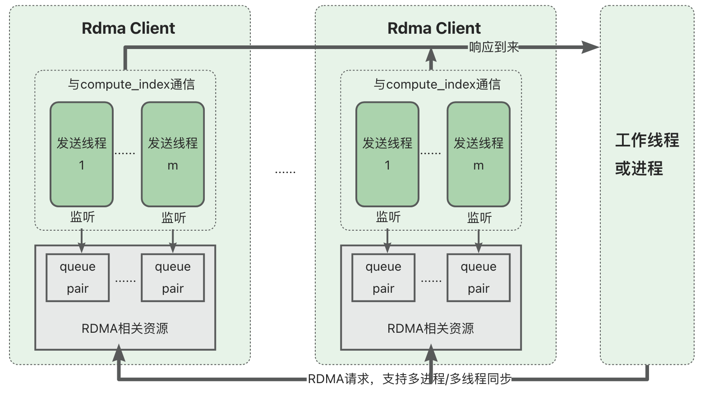

# 编译
## 一个server一个client
修改CMakeLists.txt，将下述四行代码中的三行注释掉，未注释的那行代码将会产生对应的可执行文件。
```
add_executable(test1 ./src/rdma_communication.cpp ./src/waitset.cpp ./test/myipc.cpp ./test/test_shared_memory.cpp)
add_executable(test2 ./test/test_simple_server.cpp ./src/rdma_communication.cpp ./src/waitset.cpp  ./test/test_worker_threadpool.cpp ./test/myipc.cpp) 
add_executable(test3 ./test/test_simple_server2.cpp ./src/rdma_communication.cpp ./src/waitset.cpp  ./test/test_worker_threadpool.cpp ./test/myipc.cpp) 
add_executable(test4 ./test/test_shared_client.cpp ./test/test_simple_server2.cpp ./src/rdma_communication.cpp ./src/waitset.cpp  ./test/test_worker_threadpool.cpp ./test/myipc.cpp)
```
例如test3测试多线程访问RDMA，test4测试多进程访问RDMA。

对于上述test1到test4，分别需要在include/configuration.h文件中，加入下面四行代码中的一个：
```cpp
#define TEST_SHARED_MEMORY
#define TEST_SIMPLE_SERVER
#define TEST_SIMPLE_SERVER2
#define TEST_SHARED_CLIENT
```
加入其中一个后，不能加入剩余其他的。

对于server端和client端还需要分别修改include/configuration.h文件。对于server端，需要修改
```cpp
#define MY_COMPUTE_ID (0)
// 总的计算节点个数，每个计算节点的编号是0, 1 ... TOTAL_COMPUTE_NUM-1
#define TOTAL_COMPUTE_NUM (2)

// for test
#define IS_SERVER (1)   // 是否是RdmaServer
```
对于client端，需要修改
```cpp
#define MY_COMPUTE_ID (1)
// 总的计算节点个数，每个计算节点的编号是0, 1 ... TOTAL_COMPUTE_NUM-1
#define TOTAL_COMPUTE_NUM (2)

// for test
#define IS_SERVER (0)   // 是否是RdmaServer
#define SERVER_IP ("49.52.27.135")  //RdmaServer的地址
```

至此，源文件已经配置完成。

在代码根目录下新建build文件夹，然后在build文件夹下执行：
```bash
cmake .. -DDEBUG=true
```
在build/下会产生一个用于测试的可执行文件。根据情况，会产生test1到test4这四种测试用的可执行文件。假如产生的是test4，则这样启动程序。
在server端执行：
```bash
./build/test4
```
在client端执行前，先删除共享内存段：
```bash
# 查找自己用户名的共享内存段，第一个字段是shmem id
ipcs -m
# 删除自己用户名的所有的shmem id
ipcs -m [your shmem id]
```
然后执行:
```bash
./build/test4
```

## 是否启用busy polling模式
在pgrac_configuration.h中有一个宏叫做USE_BUSY_POLLING。如果为false，则使用忙等来等待事件，如果是true，则使用IO多路复用机制来等待事件。默认为false。

## 是否启用组发送（batch）机制
在pgrac_configuration.h中有一个宏叫做USE_GROUP_POST_SEND，以及对应的参数GROUP_POST_SEND_MAX_MSG_NUM。组发送机制可以让多个连续的消息通过一个post send发送出去，而不是一个一个发送出去，这样有助于提高吞吐率。GROUP_POST_SEND_MAX_MSG_NUM表示最大允许同时发送的消息个数，这个参数可以设置在1 -- 255之间。

# 原理


## 请求响应模式
请求响应模式指的是请求者如何获得响应。主要有两种方式，第一种是请求者向服务端发送请求，服务端通过另一条链路（QP）向请求者发送响应数据，然后再通过原链路向请求者响应空数据或简单的控制数据，表明任务完成；第二种是请求者向服务端发送请求，服务端直接通过原链路向请求者响应响应数据。当不确定响应数据的长度是多少时，建议使用第一种请求响应模式，比如csnlog长度可能是几个页的长度，也可能只有几个事务的长度；当确定响应数据的长度是多少时，建议使用第二种请求响应模式，比如snapshot长度是固定的，页转移的大小也是固定的。很显然，第二种方式的延迟会更低，大部分情况下，使用第二种方式。

目前CommonRdmaClient，也就是用于多线程环境下的rdma客户端接口，未完全开发完请求响应模式；SharedRdmaClient支持第一种和第二种请求响应模式，但是需要在响应的相关状态位中指明，当前的响应数据仅仅是控制数据，还是真正的响应数据。

## 组发送机制
```cpp
/** 
 * 是否实现rdma框架层的组发送机制，也就是将一个qp中连续的多个消息一次性发送出去。
 * 如果使用组发送机制，则需要imm data做一些修改：imm data的前24个字节表示slot_idx，后8个字节
 * 表示从slot_idx开始的多少个slot都是已经到来的消息。
 */
#define USE_GROUP_POST_SEND (true)
#define IMM_DATA_SLOT_IDX_MASK (0xFFFFFF00)
#define IMM_DATA_MSG_NUM_MASK (0x000000FF)
#define IMM_DATA_SHIFT (8)
#define GROUP_POST_SEND_MAX_MSG_NUM (200)
#define GET_SLOT_IDX_FROM_IMM_DATA(imm_data) \
    ((imm_data & IMM_DATA_SLOT_IDX_MASK) >> IMM_DATA_SHIFT)
#define SET_SLOT_IDX_TO_IMM_DATA(imm_data, slot_idx) \
    (imm_data = ((slot_idx << IMM_DATA_SHIFT) | imm_data))
#define GET_MSG_NUM_FROM_IMM_DATA(imm_data) \
    (imm_data & IMM_DATA_MSG_NUM_MASK)
#define SET_MSG_NUM_TO_IMM_DATA(imm_data, msg_num) \
    (imm_data = (msg_num | imm_data))

```
组发送机制目前只支持SharedRdmaClient，也就是说多个进程的消息可以一次性发送出去。当SharedRdmaClient的发送线程收到发送事件通知后，即可检查相关共享变量来确定有多少连续的消息要发送，imm data中用于存储组发送的参数，例如slot_idx是第一个要发送的消息的slot号，后面有连续msg_num个消息未发送，则可以在imm data中的前24bit指定slot_idx，后8个字节指定msg_num，然后这个post send的内容就是这个msg_num个slot对应的内存区域。

经测试，组发送可以提高吞吐量。

## 异步发送机制
SharedRdmaClient提供了AsyncPostRequest()接口实现异步发送消息，也即post send后直接返回，不等待结果，但是AsyncPostRequest()会返回一个可调用的binder对象，以供上层在合适的时机等待参数返回。异步发送的例子是：
```cpp
void *response = nullptr;
int rc = 0;
auto wait = rdma_client->AsyncPostRequest((void *)send_buf, length, &rc); 
wait(&response); // 等待响应到来，response用于存储响应数据
```


# 问题
## fork()引起的rdma资源出错
最近4天我一直在调试一个非常奇怪的错误，他的表现大部分是这样的：SharedRdmaClient在初始化的时候会发出n个post recv，然后在整个运行过程中，它就只能收到n个消息，即使我在合适的时机继续post recv了。数据显示，SharedRdmaClient会发送n+m个消息（m是工作进程数），然后RdmaaServer也会收到n+m个消息进行处理，同时去发出n+m个post send，但是它只有n个post send会成功，SharedRdmaClient也只能收到n个回复，因此m个工作进程会因为得不到回复而一直阻塞等待。
    
问题出在fork()上。我测试的是多进程下并发访问rdma资源的场景，因此有多个rdma发送线程和多个工作进程。但是我在fork多个进程之前初始化了rdma资源，这就导致了在fork是rdma资源也在多个进程之间复制了，这是没有必要甚至错误的，因为工作进程不需要直接访问rdma资源，而是通过共享内存来告诉rdma发送线程来发送数据。当我调整顺序后就解决了这个bug，也就是，在fork多个进程之后，仅仅rdma发送线程才会初始化rdma资源。

## 其他问题
1. =和==符号弄错
2. 参数名字写反